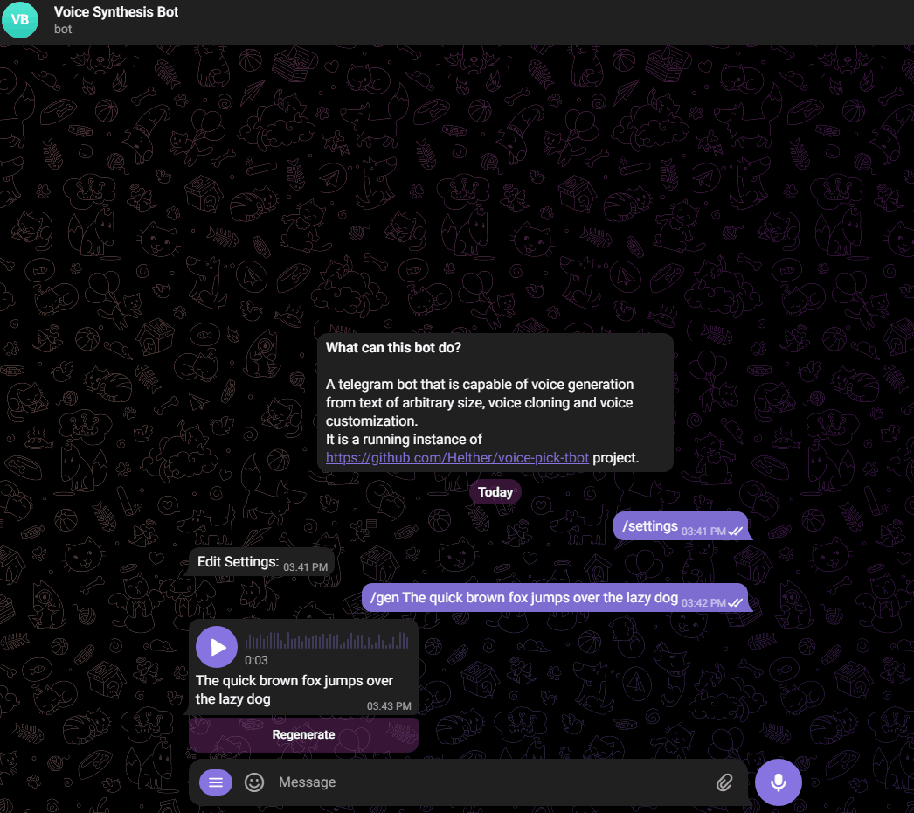

# Voice Synthesis Telegram Bot
This bot provides the ability to synthesize voice samples using tts-tortoise API from local host.

There should be a running instance of the bot, if you would like to check it out at https://t.me/tts_tbot

Here's the preview:


## Notable features
 * all of the features of tts-tortoise, including voice cloning, emotion steering, multisampling
 * user-settings database
 * custom voice adding
 
### Prerequisites
 * NVIDIA GPU (between 4 and 8Gb of VRAM required for inference)
 * python 3.10.6
 * pip or anaconda env with python 3.10.6
 * ffmpeg
 
Tested on Linux only, written with cross-platform in mind, should work on Windows. Although tortoise-tts environment may fail to resolve.
### install
```
git clone https://github.com/152334H/tortoise-tts-fast.git
python -m pip install -r ./requirements.txt
python -m pip install -e ./tortoise-tts-fast
```

### Usage
Create configuration file named "config" inside bota_data directory
and set user parameters. Use this [example](bot_data/config_example) as reference.

Run module package voice_bot from the required environment

### Notes on text promts (how to get desired results)
Use punctuation (ellipses, exclamation points, CAPS, semicolons, commas) to add emphasis and shape the speech.
You can also try to add different emotions to sentences by prepending parts of texts with "[describe emotion]" 
notations (For more info please visit [the original model source page](https://github.com/neonbjb/tortoise-tts)).

### TODO
 * add language support for ui - ru,en
 * add progress mesg for current job, send_action(ChatAction.RECORD_VOICE)
 * add voice to voice conversion, start from keyboard, use conversation and https://github.com/openai/whisper
 * add inline generation through conversation with command
 * add multi-user restriction in config

## License
This project is licensed under the MIT License - see the [LICENSE](LICENSE) file for details.
